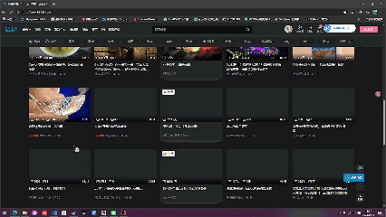

# Windows 桌宠程序

一个基于 Python + PyQt5 的 Windows 桌宠程序。它在后台监测前台窗口（或运行进程），当目标窗口/进程连续存在达到设定时长后，在屏幕指定位置弹出无边框、置顶、透明背景的桌宠图片，并播放一次音效。

## 功能特性

- 检测目标（满足任一即触发计时）：
  - 前台窗口所属进程名匹配（如 `chrome.exe`）
  - 前台窗口标题包含指定关键词（如“哔哩哔哩”）
- 两种检测模式：
  - 仅检测前台窗口（默认）
  - 检测所有运行进程（仅进程名，不检测标题）
- 达到时长阈值后显示桌宠并播放音效（单次、不循环）
- 目标消失后立即隐藏桌宠、清零计时、停止音效
- 图形化设置界面，保存后立即生效，配置持久化到 `config.json`
- 系统托盘图标：显示/隐藏桌宠、打开设置、退出程序
- 桌宠窗口：无边框、置顶、透明背景、可拖动、支持鼠标穿透
- 屏幕变暗：桌宠弹出时全屏覆盖半透明遮罩，不透明度可调（0~100%）
- 默认图片：内置 `dagou.png`，默认位置屏幕居中
- 默认音效：内置 `dagoujiao.MP3`

## 快速开始
> 如果你只是**使用**本程序，无需安装 Python 或任何依赖，直接运行打包好的程序即可。

1. 获取程序：
   - **安装版**：双击 `大狗嚼.exe`安装，完成后从桌面/开始菜单启动。
2. 启动后，程序会弹出设置界面，系统托盘出现图标（程序常驻后台）。
3. 在设置界面配置你想要的目标（进程名或窗口标题关键词）、触发时长等，点「保存」即可立即生效。
4. 关闭设置窗口后程序继续在后台监测；可通过托盘图标随时再打开设置、显示/隐藏桌宠或退出。

**默认行为**：检测到 哔哩哔哩 为关键词的前台窗口持续 5 秒后，屏幕变暗，`dagou.png` 全屏渐变弹出并播放 `dagoujiao.MP3`，显示 3 秒后自动隐藏，然后重新计时循环提醒。
效果如下：



## 依赖安装

建议使用 Python 3.10+。在项目目录下执行：

```bash
pip install -r requirements.txt
```

或手动安装：

```bash
pip install PyQt5 psutil pywin32
```

## 运行方式

```bash
python main.py
```

## 打包为 EXE（可选）

程序支持使用 PyInstaller 打包为独立的 Windows 可执行文件，双击即可运行，无需安装 Python。

首先安装 PyInstaller：

```bash
pip install pyinstaller
```

然后执行以下命令打包（单文件、无控制台窗口、命名桌宠）：

```bash
pyinstaller --noconfirm --clean --onefile --windowed --name 桌宠 main.py
```

- 打包完成后，可执行文件位于 `dist\桌宠.exe`。
- 将 `dist\桌宠.exe` 复制到任意目录，双击即可运行。
- `config.json` 会自动生成在 exe 所在目录（已针对 PyInstaller 做了路径适配，重启后配置不会丢失）。
- 也可直接双击项目根目录下的 `build_exe.bat` 完成打包。
- 注意：程序默认使用 `dagou.png` 作为桌宠图片、`dagoujiao.MP3` 作为默认音效（相对路径会解析为 exe 同目录），默认位置为屏幕居中。若指定了其它图片或音效文件，请将它们与 exe 放同一目录，或在设置界面用“浏览”选择绝对路径。

## 制作安装程序（分发）

传播给他人时，有两种选择：

### 方案一：直接分发绿色版（最简单）

直接把 `dist\桌宠.exe` 发给对方即可，双击运行、无需安装、不依赖 Python。缺点是需手动创建快捷方式、无卸载入口。

### 方案二：制作标准安装程序（推荐）

使用 [Inno Setup 6](https://jrsoftware.org/isdl.php)（免费）生成带卸载、快捷方式、开机启动选项的安装包。

1. 安装 Inno Setup 6。
2. 确保已生成 `dist\桌宠.exe`（若没有，先执行 `build_exe.bat` 或打包命令）。
3. 双击 `build_installer.bat`（自动打包 + 调用 ISCC 编译），或在 Inno Setup 编译器中打开 `installer.iss` 编译。
4. 产物位于 `installer\桌宠安装程序.exe`。

`installer.iss` 已配置：
- 安装目录默认 `%ProgramFiles%\桌宠`（普通用户权限即可安装）。
- 可选择「创建桌面快捷方式」与「开机自动启动」。
- 开始菜单提供「桌宠」与「卸载桌宠」入口。
- 简体中文界面、LZMA2 高压缩、支持中文路径。

> 若要替换图标，准备一个 `app.ico`，在 `installer.iss` 的 `SetupIconFile` 处指定；同时可在打包命令加 `--icon app.ico` 给 exe 换图标。

## 文件结构

```
main.py            程序入口
config_manager.py  配置读写（config.json）
detector.py        目标检测（前台窗口/运行进程）
pet_window.py      桌宠窗口
sound_player.py    音效播放（PyQt5.QtMultimedia）
settings_dialog.py 设置对话框
overlay.py         全屏变暗遮罩
tray_icon.py       系统托盘管理
requirements.txt   依赖清单
build_exe.bat      一键打包 exe
build_installer.bat 一键生成安装程序
installer.iss      Inno Setup 安装脚本
```

## 使用说明

1. 运行程序后，系统托盘出现图标，桌宠默认隐藏。
2. 双击托盘图标（或右键菜单“打开设置”）打开设置界面。
3. 设置图片、音效、阈值、目标进程/标题关键词、检测模式、间隔、尺寸、位置、鼠标穿透等。
4. 点击“保存”立即生效，无需重启。

## 验收示例

1. 打开设置，图片路径选择一张本地 PNG，阈值设为 10 秒，目标进程添加 `notepad.exe`，保存。
2. 打开记事本并保持前台，10 秒后桌宠弹出并播放音效。
3. 切换到其它窗口，桌宠立即隐藏；切回记事本重新计时。
4. 将阈值改为 5 秒并保存，切回记事本后 5 秒弹出。
5. 拖动桌宠到其它位置，关闭并重开程序，位置保持（保存为自定义坐标）。
6. 退出后，`config.json` 保存了所有修改。

## 说明

- 音效采用 `PyQt5.QtMultimedia`（QMediaPlayer），原因：支持 WAV/MP3 等常见格式，且无需额外第三方依赖，避免 pygame 在较新 Python 版本下因缺少预编译包而无法安装。
- 非 Windows 平台仅展示 GUI，检测功能不可用。